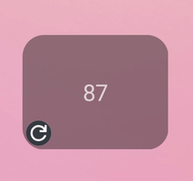
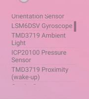

# Appy  

[Docs](https://github.com/talshahaf/appy/wiki) | [Latest APK](https://github.com/talshahaf/appy/releases) | [Installation and Quickstart](https://github.com/talshahaf/appy/wiki#installation) | [Examples](https://github.com/talshahaf/appy/wiki/Examples)  

Appy allows you to code android widgets in Python!  

- A simple UI coding library.  
- Full access to java methods and objects.  
- Support for common python libraries: requests, dateutil, numpy, matplotlib, pillow  
- pip (for pure python packages)  

Write dashboards and mini apps with few lines of code, allowing you to customize your phone and have important information at a glance.  

This is especially useful when you only need to present updated information from the web with minimal parsing:  
```py
import requests
from appy.templates import updating_text

def on_refresh():
    return requests.get('https://www.example.com/api/random-number').json()['number']

updating_text('info', on_refresh=on_refresh, interval=3600)
```  

Result:  
  

Or when you want to perform a quick action from your homescreen:  
```py
import requests
from appy.widgets import register_widget, Button

def click():
    requests.post('https://www.example.com/api/turn/on/lights', data={'color': 'red'})

def create():
    return [Button(text='CLICK ME!', click=click)]

register_widget('button', create)
```  

Result:  
  
(Imagine a light turned on somewhere.)  

Calling java/Android is easy:  
```py
from appy.widgets import register_widget, ListView, TextView, java_context
from appy.java import clazz

def create():
    sensorService = java_context().getSystemService(java_context().SENSOR_SERVICE)
    sensors = sensorService.getSensorList(clazz.android.hardware.Sensor().TYPE_ALL).toArray()
    names = [sensor.getName() for sensor in sensors]
    return [ListView(children=[TextView(text=name) for name in names])]

register_widget('java', create)
```  

Result:  
  

And more:  
 
   

## Build  
Create a new file called `local.properties` that points to your installed [SDK](https://developer.android.com/tools/releases/platform-tools):  
```
sdk.dir=<path to SDK>
```

### Linux  
```
# generate debug apk
./gradlew assembleDebug

# generate release apk
./gradlew assembleRelease

# generate signed release apk
./gradlew assembleRelease -Pandroid.injected.signing.store.file=$KEYFILE \
 -Pandroid.injected.signing.store.password=$STORE_PASSWORD \
 -Pandroid.injected.signing.key.alias=$KEY_ALIAS \
 -Pandroid.injected.signing.key.password=$KEY_PASSWORD
```

### Windows  
```
@rem generate debug apk
gradlew.bat assembleDebug

@rem generate release apk
gradlew.bat assembleRelease

@rem generate signed release apk
gradlew.bat assembleRelease -Pandroid.injected.signing.store.file=$KEYFILE \
 -Pandroid.injected.signing.store.password=$STORE_PASSWORD \
 -Pandroid.injected.signing.key.alias=$KEY_ALIAS \
 -Pandroid.injected.signing.key.password=$KEY_PASSWORD
```
