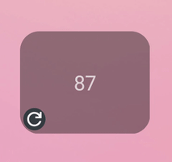
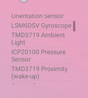
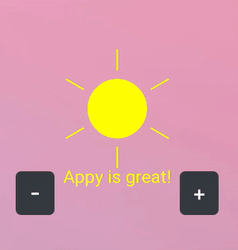

# Appy  

[Docs](https://github.com/talshahaf/appy/wiki) | [Latest APK](https://github.com/talshahaf/appy/releases) | [Installation and Quickstart](https://github.com/talshahaf/appy/wiki#installation) | [Examples](https://github.com/talshahaf/appy/wiki/Examples)  

Appy allows you to code android widgets in Python!  

- A simple UI coding library.  
- Full access to java methods and objects.  
- Support for common python libraries: requests, dateutil, numpy, matplotlib, pillow  
- pip (for pure python packages)  

Write dashboards and mini apps with few lines of code, allowing you to customize your phone and have important information at a glance.  

This is especially useful when you only need to present updated information from the web with minimal parsing:  
```py
import requests
from appy.templates import updating_text

def on_refresh():
    return requests.get('https://www.example.com/api/random-number').json()['number']

updating_text('info', on_refresh=on_refresh, interval=3600)
```  

Result:  
  

Or when you want to perform a quick action from your homescreen:  
```py
import requests
from appy.widgets import register_widget, Button

def click():
    requests.post('https://www.example.com/api/turn/on/lights', data={'color': 'red'})

def create():
    return [Button(text='CLICK ME!', click=click)]

register_widget('button', create)
```  

Result:  
  
(Imagine a light turned on somewhere.)  

Calling java/Android is easy:  
```py
from appy.widgets import register_widget, ListView, TextView, java_context
from appy.java import clazz

def create():
    sensorService = java_context().getSystemService(java_context().SENSOR_SERVICE)
    sensors = sensorService.getSensorList(clazz.android.hardware.Sensor().TYPE_ALL).toArray()
    names = [sensor.getName() for sensor in sensors]
    return [ListView(children=[TextView(text=name) for name in names])]

register_widget('java', create)
```  

Result:  
  

And more:  
 
   

## Build  
Create a new file called `local.properties` that points to your installed [SDK](https://developer.android.com/tools/releases/platform-tools):  
```
sdk.dir=<path to SDK>
```

### Linux  
```
# generate debug apk
./gradlew assembleDebug

# generate release apk
./gradlew assembleRelease

# generate signed release apk
./gradlew assembleRelease -Pandroid.injected.signing.store.file=$KEYFILE \
 -Pandroid.injected.signing.store.password=$STORE_PASSWORD \
 -Pandroid.injected.signing.key.alias=$KEY_ALIAS \
 -Pandroid.injected.signing.key.password=$KEY_PASSWORD
```

### Windows  
```
@rem generate debug apk
gradlew.bat assembleDebug

@rem generate release apk
gradlew.bat assembleRelease

@rem generate signed release apk
gradlew.bat assembleRelease -Pandroid.injected.signing.store.file=$KEYFILE \
 -Pandroid.injected.signing.store.password=$STORE_PASSWORD \
 -Pandroid.injected.signing.key.alias=$KEY_ALIAS \
 -Pandroid.injected.signing.key.password=$KEY_PASSWORD
```

## Additional Info  

### Requirements  
Android 12+ with an arm64 processor.  
Can also run on Android 8+ but with limited support.  

### AI  
No AI was used to develop Appy.  
But it doesn't have any problem creating widgets as well: (tested on Claude Sonnet 4.6)  
```
Hi, read the docs of this framework:
https://github.com/talshahaf/appy/wiki
And build me a widget with a textview that changes text color each time you click it using that framework
```

<br/>  
<br/>  

```
Here's your Appy widget! Here's how it works:

A TextView labeled "Tap me!" is centered on the widget. The click callback is set directly on it, so tapping the text itself cycles through 6 colors (red → orange → green → blue → purple → white → back to red).
widget.state.color_index persists the current color index between taps.
The color list uses widgets.color(r, g, b) as shown in the Appy docs.

To use it: transfer color_text_widget.py to your Android device (e.g. into Android/media/com.appy.widgets/), import it via the Appy Files tab, add an Appy widget to your homescreen, and select color_text.
```

```py
from appy import widgets
from appy import register_widget
 
COLORS = [
    widgets.color(r=255, g=80,  b=80),   # red
    widgets.color(r=255, g=180, b=0),    # orange
    widgets.color(r=80,  g=220, b=80),   # green
    widgets.color(r=80,  g=180, b=255),  # blue
    widgets.color(r=200, b=255, g=80),   # purple
    widgets.color(r=255, g=255, b=255),  # white
]
 
def click(widget, views):
    widget.state.color_index = (widget.state.color_index + 1) % len(COLORS)
    views['label'].textColor = COLORS[widget.state.color_index]
 
def create(widget):
    widget.state.color_index = 0
 
    label = widgets.TextView(
        name='label',
        text='Tap me!',
        textSize=36,
        textColor=COLORS[0],
        click=click,
        hcenter=widget.hcenter,
        vcenter=widget.vcenter,
    )
 
    return [label]
 
register_widget('color_text', create)
 
```
